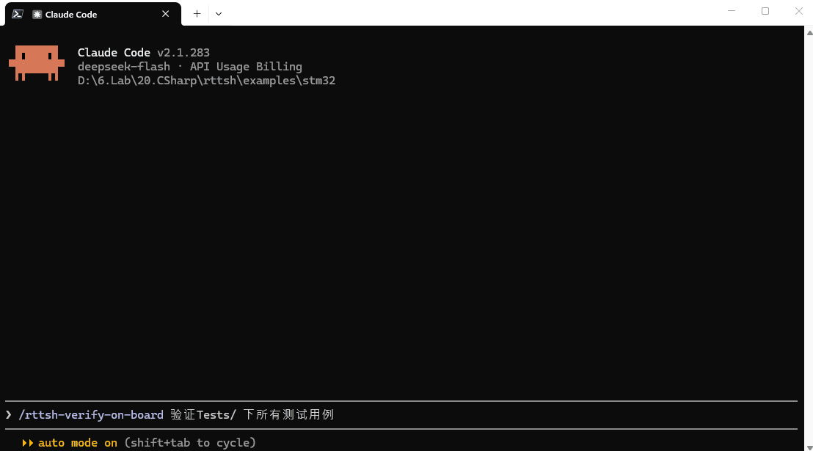

# rttsh

rttsh 是基于 SEGGER J-Link RTT 的命令行终端，用于固件的自动化在板验证。固件通过 SEGGER RTT 提供命令行控制台，主机侧以 Lua 脚本发送命令、匹配应答、断言输出与时序，使上板验证可批量执行并可纳入 CI。通信与烧录共用同一调试探针，不占用目标板的 UART 等外设。

面向 AI 编码代理提供 MCP 服务器（`rttsh mcp`）与技能 `skills/rttsh-verify-on-board`。

<div align="center">
  
</div>

## 环境要求

Windows（依赖 JLink_x64.dll 与 lua54）；.NET 10 运行时（framework 安装包需要，self-contained 包自带）；SEGGER J-Link 驱动与探针（JLink DLL 自动探测，可 `--dll` 指定）；已链接 RTT 控制块（`_SEGGER_RTT`）并烧录到目标板的固件。安装包与源码构建见 `installer/`。

## 用法

`--chip` 必须与 J-Link 设备数据库中的名称一致（忽略大小写），可用 `rttsh list-devices --filter H743` 查询；名称无效时直接报错退出（exit 2），不会触发设备选择弹窗。

发送一行并等待应答：

```bash
rttsh send "led r on" --chip STM32H743XI --wait 300
```

`--hex` 可发送原始字节。不带子命令运行则进入交互终端（`-tui` 为对话式布局），Ctrl+C 退出；输出重定向时转为只收模式，可接 `grep` 等过滤。

脚本模式是自动化验证的核心。`script --eval` 可直接内联执行 Lua：

```bash
rttsh script --eval 'rtt.send("led r toggle"); rtt.expect("LED r toggled", 500)' --chip STM32H743XI
```

成体系的用例写成脚本文件。`rtt.expect` 返回匹配文本，可读回应答字段做状态断言：

```lua
-- Tests/t21_led_query.lua
local function query_led(name)
  rtt.send("led "..name)
  local q = rtt.expect("LED "..name.." %a+", 500)
  return q:match("LED "..name.." (%a+)")
end
local g0 = query_led("g")
rtt.send("led g toggle")
rtt.expect("LED g toggled", 500)
assert(query_led("g") ~= g0, "state did not flip")
rtt.log("t21 PASS")
```

完整套件在 `examples/stm32/Tests`（23 个脚本，需真实目标板），覆盖字段提取、否定断言、计时窗口、通道独立性等场景。

expect 超时即失败（exit 1），错误信息附接收缓冲区尾部，可直接看到固件的实际应答。`rtt.*` API 还覆盖二进制收发与目标内存读写（`rtt.mem_read`/`rtt.mem_write`）。

RTT 控制块地址默认由 SDK 扫描 RAM 得出；`--elf <镜像>` 改为从 `_SEGGER_RTT` 符号解析，随重编译自动更新，结果缓存在 `.rttsh/elf-cache/`。

运行参数可写入工作目录下的 `.rttsh/config.json`，自动加载（键：chip、speed、interface、sn、channel、rttAddr、rttRange、elf、dll、encoding、eol、wait、scriptTimeout、log，类型与默认值见 `rttsh manual`）。`-C/--root` 切换运行基准目录；`--log` 记录会话收发。

## 命令

| 命令                      | 作用                                     |
| ----------------------- | -------------------------------------- |
| （无子命令）                  | 交互式 RTT 终端                             |
| `send <text>`           | 发送一次，可选等待应答                            |
| `script [<file.lua>]`   | 运行 Lua 脚本，或 `--eval <代码>`              |
| `flash download <file>` | 烧录 hex/elf/mot/bin；raw .bin 需 `--addr` |
| `flash erase`           | 整片擦除；重定向 stdin 时需 `--yes`              |
| `mcp`                   | 以 stdio 运行 MCP 服务器                     |
| `list-devices`          | 列出设备数据库（`--filter` 过滤）                 |
| `manual`                | 打印参考手册                                 |

> flash 操作完成后核心保持 halted，带 `--reset` 以在操作完成后复位。

退出码：0 成功，1 运行失败（含 expect 超时），2 用法错误。exit 0 仅表示 rttsh 自身无错误，固件层错误同样返回 0，判定必须依据应答文本。

## MCP

`rttsh mcp` 由 MCP 客户端以 stdio 启动，提供 connect、disconnect、get_status、send、rtt_read、expect、mem_read、list_devices 八个工具，与 Lua 脚本共用同一执行引擎，任意时刻至多持有一个目标会话。注册示例：

```json
{ "mcpServers": { "rttsh": { "command": "rttsh", "args": ["mcp"] } } }
```

## 文档

`rttsh manual` 为完整参考（配置键、`rtt.*` API、脚本编写要点）；`rttsh --help` 及各子命令 `--help` 列出全部选项与默认值。
