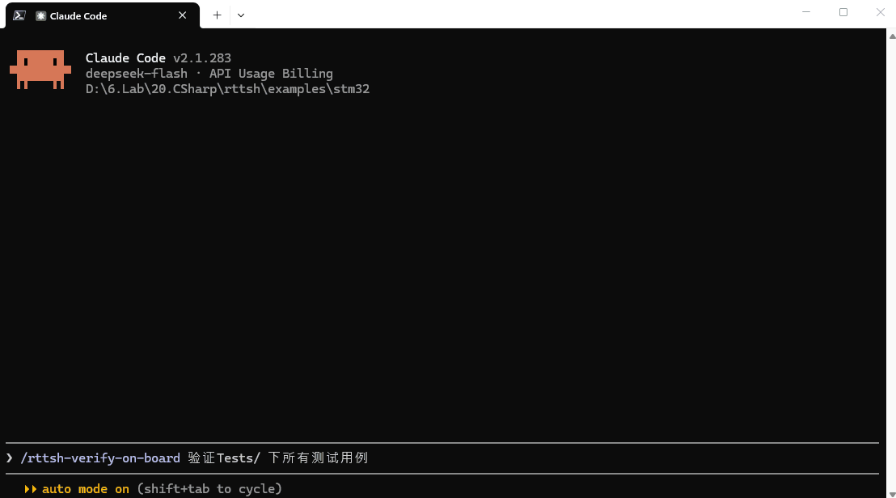

# rttsh

English | [简体中文](README_zh-cn.md)

**rttsh** is a command-line terminal over SEGGER J-Link RTT for automated on-board firmware verification. The firmware exposes a command console through SEGGER RTT; on the host side, Lua scripts send commands, match responses, and assert on output and timing, so on-board verification can run in batches and be wired into CI. Communication and flashing share the same debug probe and do not occupy target peripherals such as UART.

An MCP server (`rttsh mcp`) and the `skills/rttsh-verify-on-board` skill are provided for AI coding agents.

<div align="center">
  
</div>

## Requirements

Windows (depends on JLink_x64.dll); the .NET 10 runtime (needed by the framework-dependent installer, bundled in the self-contained package); the SEGGER J-Link driver and a probe (the J-Link DLL is auto-detected, or point to one with `--dll`); firmware linked with the RTT control block (`_SEGGER_RTT`) and already flashed to the target board. See `installer/` for installers and building from source.

## Usage

`--chip` must match a name from the J-Link device database (case-insensitive); look it up with `rttsh list-devices --filter H743`. An invalid name fails fast with an error (exit 2) and never opens the device-selection dialog.

Send one line and wait for the response:

```bash
rttsh send "led r on" --chip STM32H743XI --wait 300
```

`--hex` sends raw bytes. Running without a subcommand opens an interactive terminal (`-tui` selects the chat-style layout), Ctrl+C to exit; when output is redirected it switches to receive-only mode, so it can be piped through `grep` and the like.

Script mode is the core of automated verification. `script --eval` runs Lua inline:

```bash
rttsh script --eval 'rtt.send("led r toggle"); rtt.expect("LED r toggled", 500)' --chip STM32H743XI
```

Systematic test cases are written as script files. `rtt.expect` returns the matched text, the match itself, and the pattern's captures as extra values, so response fields are captured in one step:

```lua
-- Tests/t21_led_query.lua
local function query_led(name)
  rtt.send("led "..name)
  local t, m, state = rtt.expect("LED "..name.." (%a+)", 500)
  return state
end
local g0 = query_led("g")
rtt.send("led g toggle")
rtt.expect("LED g toggled", 500)
assert(query_led("g") ~= g0, "state did not flip")
rtt.log("t21 PASS")
```

The full suite lives in `examples/stm32/Tests` (23 scripts, a real target board required), covering field extraction, negative assertions, timing windows, channel independence, and more.

An expect timeout is a failure (exit 1), and the error message includes the tail of the receive buffer so the firmware's actual response is visible right in the failure. The expect family covers the common shapes: `rtt.try_expect` returns `nil, msg` on a quiet window instead of raising (polling loops), `rtt.expect_absent` is a first-class negative assertion, `rtt.expect_any` waits for whichever of several patterns matches first, `rtt.read_line` consumes one newline-terminated line (nil on timeout), and `rtt.flush` discards stale output. The `rtt.*` API also covers binary transfer and target memory access (`rtt.mem_read`/`rtt.mem_write`; `rtt.mem_read(addr)` reads one 32-bit unit as a scalar).

By default the RTT control-block address is found by scanning RAM from the SDK; `--elf <image>` resolves it from the `_SEGGER_RTT` symbol instead, following rebuilds automatically.

Runtime options can be written to `.rttsh/config.json` in the working directory and are loaded automatically (keys: chip, speed, interface, sn, channel, rttAddr, rttRange, elf, encoding, eol, wait, scriptTimeout, log; types and defaults in `rttsh manual`). Machine-level tool paths live in `~/.rttsh/settings.json` (keys: `dll`, `fromelf`; command line wins; types and details in `rttsh manual`). `-C/--root` switches the base directory; `--log` records session traffic.

## Commands

| Command                 | Description                                                 |
| ----------------------- | ----------------------------------------------------------- |
| (no subcommand)         | Interactive RTT terminal                                    |
| `send <text>`           | Send once, optionally wait for a response                   |
| `script [<file.lua>]`   | Run a Lua script, or `--eval <code>`                        |
| `flash download <file>` | Flash hex/elf/mot/bin; raw .bin requires `--addr`; ELF/AXF converts via fromelf (`--fromelf` / `~/.rttsh/settings.json`) |
| `flash erase`           | Chip-wide erase; `--yes` required when stdin is redirected  |
| `mcp`                   | Run the MCP server over stdio                               |
| `list-devices`          | List the device database (filter with `--filter`)           |
| `manual`                | Print the reference manual                                  |

> The core remains halted after flash operations; pass `--reset` to reset it once the operation completes.

Exit codes: 0 success, 1 run failure (including expect timeouts), 2 usage error. Exit 0 only means rttsh itself ran without error — firmware-level errors also return 0, so verdicts must be based on response text.

## MCP

`rttsh mcp` is launched over stdio by an MCP client and provides eight tools — connect, disconnect, get_status, send, rtt_read, expect, mem_read, list_devices — sharing the same execution engine as the Lua scripts and holding at most one target session at a time. Registration example:

```json
{ "mcpServers": { "rttsh": { "command": "rttsh", "args": ["mcp"] } } }
```

## Documentation

`rttsh manual` is the full reference (config keys, the `rtt.*` API, scripting essentials); `rttsh --help` and each subcommand's `--help` list all options with their defaults.
